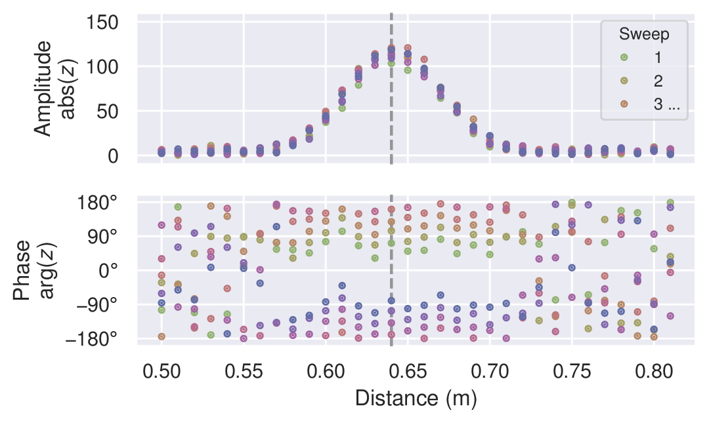
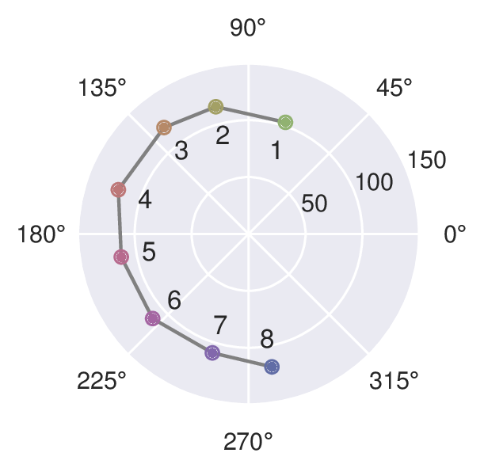
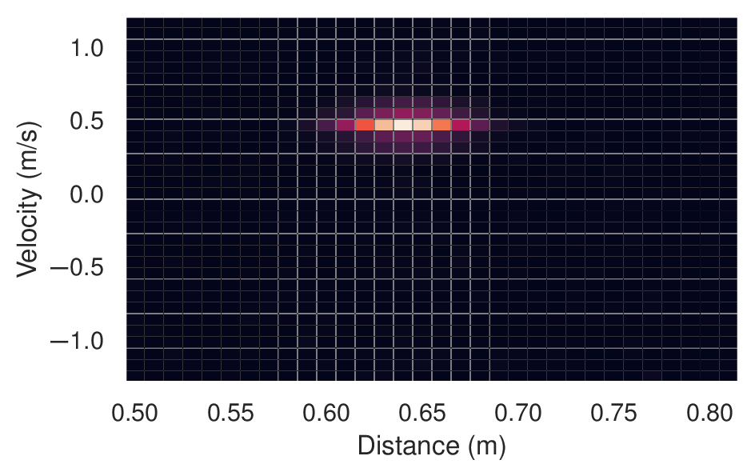

# Data acquisition

The acquisition flow is divided in two separate sections executed in different moments:
  - SCRIPT A $\to$ synthetic data acqusition of the simulated motion (generated based on the parameters of the Acconeer A12)
  - SCRIPT B $\to$ offline processing and training+testing the RF
The pipeline will be the following:
        
> **Kinematics Sim (inspired by MoCap DB) $\to$ Synthetic IQ signals $\to$ Range-Doppler maps $\to$ Feature extraction $\to$ RF classifier**

## SCRIPT A - Synthetic data generation

### Kinematics simulation of the 6 motions

In this section I simulate all the 6 motions: walking, bending, drinking, lying, sitting and falling. What I do, since I don't have real data, is to implement this function which represents the human body as 7 scatterer points: Pelvis (Root), Torso, Head, Right Hand, Left Hand, Right leg, Left leg.

I assign a **RCS (Radar Cross Section)** in order to have a different electromagnetic 
reflection in every body part. For example the Torso has a much bigger surface and 
refelects more (RCS = 1.0) with respect to the hand (RCS = 0.15) (the reference paper 
for this idea is [Chen, V. C. (2019). The Micro-Doppler Effect in Radar (2nd ed.). Artech House.](https://books.google.it/books/about/The_Micro_doppler_Effect_in_Radar.html?id=eJ7eMHpxt30C&redir_esc=y)).

#### 3D Reference System Convention

The Cartesian coordinate system $[X, Y, Z]$ is defined as follows:
- **X-axis (Transverse):** Represents the body's lateral displacement relative to the radar boresight axis.
- **Y-axis (Radial / Line of Sight - LOS):** Represents the distance from the radar (positioned at $[0, 0, 1]$). A variation $\Delta Y < 0$ indicates an approach toward the radar.
- **Z-axis (Vertical):** Represents the height above ground ($Z = 0\text{ m}$).

Then we make a 3D mapping *(x,y,z)* of the 7 points evolving in time *t* for every action:
- **Walking:** Models a coordinated rectilinear translation toward the radar with periodic strides.
  - **Pelvis (0 - Root), Torso (1), Head (2):** Move continuously and uniformly along the Y-axis toward the radar at an average speed of $0.6\text{ m/s}$. Vertical heights ($Z$) remain constant at $1.0\text{ m}$ (pelvis), $1.4\text{ m}$ (torso), and $1.7\text{ m}$ (head), respectively.
  - **Hands (3, 4):** Translate globally along $Y$ together with the trunk, adding a periodic harmonic anti-phase oscillation along $Y$ (natural arm swing at $1.5\text{ Hz}$).
  - **Feet (5, 6):** Perform alternating motions phase-shifted by $180^\circ$. During the **swing phase**, the foot lifts off the ground ($Z > 0$) and advances rapidly along $Y$; during the **stance phase**, the foot touches the ground ($Z = 0\text{ m}$), providing propulsion.

- **Bending Forward:** Models forward trunk flexion to reach toward the ground, followed by a return to the upright position.
  - **Pelvis (0):** Performs a slight backward translation along $Y$ ($+0.2\text{ m}$) to counterbalance the shifting center of mass and prevent loss of balance, maintaining $Z \approx 1.0\text{ m}$.
  - **Torso (1) and Head (2):** Rotate forward around the pelvis joint. The head lowers drastically to $Z = 0.8\text{ m}$ and advances toward the radar up to $0.7\text{ m}$ along $Y$.
  - **Hands (3, 4):** Follow trunk rotation, extending downward ($Z \to 0.2\text{ m}$) and forward toward the radar along $Y$.
  - **Feet (5, 6):** **Firmly anchored to the ground** ($Z = 0\text{ m}$, $Y = \text{constant}$). They serve as the fixed support pivot around which the kinematic chain rotates.

- **Drinking:** Models an action with a stationary body and isolated movement of an upper limb.
  - **Pelvis (0), Torso (1), Head (2), Feet (5, 6), Left Hand (4):** Remain completely static in an upright position. Feet are constrained to the ground ($Z = 0\text{ m}$).
  - **Right Hand (3):** The only moving point. Follows an upward curved trajectory along $Z$ (from $0.9\text{ m}$ to $1.6\text{ m}$) and moves toward the central axis ($X = 0$), simulating the gesture of bringing a glass to the mouth.

- **Lying:** Models a static condition on the ground (e.g., post-fall or resting) with a respiratory micro-movement component.
  - **All Points (0–6):** Collapsed on the horizontal plane at negligible heights ($Z \approx 0.1\text{ m}$). The body is aligned along the radial Y-axis:
  - **Feet (5, 6):** Points closest to the radar ($Y = 2.5\text{ m}$).
  - **Pelvis (0):** Positioned at $Y = 3.4\text{ m}$.
  - **Torso (1) and Head (2):** Points furthest away ($Y = 3.9\text{ m}$ and $Y = 4.2\text{ m}$).
  - **Torso (1):** Exhibits a low-amplitude ($\pm 2\text{ cm}$) vertical harmonic micro-oscillation at $1.5\text{ Hz}$ along $Z$ to simulate chest wall movement during breathing.

- **Sitting:** Models the transition from a standing to a seated position with a smooth velocity profile (*ease-in-out* via cosine interpolation).

  - **Pelvis (0):** Undergoes a controlled descent along $Z$ from $1.0\text{ m}$ to $0.5\text{ m}$, moving slightly backward along $Y$ ($+0.2\text{ m}$) to settle onto the seat.
  - **Torso (1) and Head (2):** Track the descent of the pelvis while maintaining vertical trunk alignment, lowering to $Z = 0.9\text{ m}$ and $Z = 1.2\text{ m}$, respectively.
  - **Hands (3, 4):** Accompany the trunk's downward movement, lowering and shifting slightly forward along $Y$ to rest on the knees.
  - **Feet (5, 6):** **Immovable on the ground** ($Z = 0\text{ m}$, $Y = \text{constant}$). They act as a fixed kinematic constraint forward of the pelvis to allow knee flexion.

- **Forward fall:** Models an uncontrolled fall driven by gravity with an accelerated parabolic motion profile ($Z \propto t^2$):

  - **Pelvis (0), Torso (1), Head (2):** Undergo a rapid collapse toward the ground. The head drops from height $Z = 1.7\text{ m}$ to $Z = 0.2\text{ m}$ with temporal acceleration, accompanied by a strong forward projection along the Y-axis (sudden approach toward the radar).
  - **Hands (3, 4):** Project forward and downward in an instinctive attempt to cushion impact with the ground.
  - **Feet (5, 6):** Maintain their position on the ground ($Z = 0\text{ m}$), acting as a **fixed rotational pivot** over which the body overturns prior to final impact.

### Simulation IQ signal from the Acconeer A121

TheAcconeer A121 is a **Pulsed Coherent Radar (PCR)** operating in the V-Band
(microwave portion of the electromagnetic spectrum ranging from $40 \text{to} 75 \text{GHz}$) at $60 \text{GHz}$. Unlike other simple motion sensors that onl
measure amplitude, a coherent radar measures **both the amplitude and phase** of the
reflected signal. This phase information is the secret to extracting micro-Doppler
signatures.

#### The micro-Doppler signatures

To understand what these signatures are, it helps to break down human motion into two distinct physical components:

- **Bulk Motion (Macro-Doppler):** This is the gross translational movement of the target's center of mass. In our 7-point model, this is the continuous forward progression of the Pelvis and Torso. On a radar frequency plot, this creates a strong, central, slowly changing frequency track.

- **Micro-Motion (Micro-Doppler):** These are the localized movements of the body's limbs rotating or oscillating relative to the center of mass. As a person walks, the *Hands* swing back and forth, and the *Feet* accelerate to take a step and then decelerate to a complete stop on the ground.

Because velocity determines the Doppler frequency ($f_D = \frac{2v}{\lambda}$),
these varying velocities create distinct frequency "tracks" that orbit the main
torso track. A foot swinging forward will generate a sudden, high-frequency spike
(because it moves much faster than the torso), followed by a drop to zero frequency (when it is planted on the ground).

Micro-Doppler signatures transform radar from a simple motion detector (which just tells you "something is there") into an advanced classification sensor (which tells you "what it is and what it is doing").

#### Range-Doppler maps and how to interpret the data from the Acconeer A121

The A121 Sparse IQ data is represented by complex numbers, one for each distance
sampled. Each number has an amplitude and a phase, the amplitude is obtained by
taking the absolute value of the complex number and the phase is obtained by taking
the argument of the same complex number. A sweep is a array of these complex values
corresponding to an amplitude and phase of the reflected pulses in the configured
range.

For any given frame, we let $z(s,d)$ be the complex IQ value (point) for a sweep *s*
and a distance point *d*.

In many cases, we want to track and/or detect moving objects in the range. This is demonstrated in the figure above, where the object has moved during the measurement of the frame. The sweeps still have roughly the same amplitude, but the phase is changing. Due to this, we can no longer coherently average the sweeps together. However, we can still (non-coherently) average the amplitudes.

To track objects over long distances we may track the amplitude peak as it moves, but for accurately measuring finer motions we need to look at the phase.
Over the $8$ sweeps in the example frame, the phase changed $\approx 210\deg$. A full phase rotation of $360\deg$ translates to $\frac{𝜆_{RF}}{2} \approxeq 2.5⁢mm$
, so the $210\deg$ corresponds to $\approx 1.5 mm$.

As evident from the example above, even the smallest movements change the phase and thus move the signal in the complex plane. This is utilized in for example the presence detector, which can detect the presence of humans and animals from their breathing motion.

As shown, the complex data can be used to track the relative movement of an object. By combining this information with the sweep rate, we can also determine its velocity. In practice, this is commonly done by applying the fast Fourier transform (FFT) to the frame over sweeps, giving a distance-velocity (a.k.a.range-Doppler) map. Each cell of the Range-Doppler map represents This method is commonly used for applications such as micro and macro gesture recognition, velocity measurements, and object tracking.

### Feature extraction from Range-Doppler maps

The used features for the classification of movements are extracted from the Range-Doppler map
